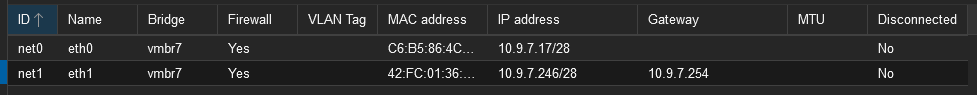

= GH_Pages-AutoPublish docs-index

 * xref:doc-01.adoc[doc-01]
 * xref:doc-02.adoc[doc-02]
 * xref:doc-03.adoc[doc-03]


== Erstellen des Routers

Create CT (da dieser leichtgewichtiger ist) +
Template: ubuntu +
System Dimensionierung festlegen

Netzwerk einrichten:
- CT auswählen
- Network Tab
- add Network Device



In den Container einloggen, eventuell SSH installieren

==== Gluenet initialisieren:

```bash
sudo apt-get update
sudo apt upgrade
cd /etc

nano sysctl . conf
```

Now add this statement into the file:

```bash
net. ipv4. ip forward
```

Assuming your public interface is eth1 and local interface is eth0

2- Set natting the natting rule with:
```bash
iptables -t nat -A POSTROUTING -o eth1 -j MASQUERADE
```
3- Accept traffic from eth0:
```bash
iptables -A INPUT -i eth0 -j ACCEPT
```
4- Allow established connections from the public interface.
```bash
iptables -A INPUT -i eth1 -m state --state ESTABLISHED,RELATED -j ACCEPT
```
5- Allow outgoing connections:
```bash
iptables -A OUTPUT -j ACCEPT
```


== Erstellen des Desktop-Clients
Create VM +
Image: Lubuntu-Template ISO (lubuntu-22.10-desktop-amd64.iso) +
System dimensionierung festlegen.

Die VM zum Internet verbinden:

- VM auswählen
- Hardware Tab
- add Network Device oder bearbeiten und richtige bridge auswählen

Then go to Networksettings on the Desktop. +
Add: IP, Mask, Gateway

XRDP einrichten:
[source, bash]
----
sudo apt-get update
sudo apt upgrade
sudo apt-get install xrdp
----

== Erstellen des DNS-AdBlockers
* ``Create CT`` klicken
* Konfigurieren
** Node -> pve01
** CT_ID -> 7141
** Hostname -> dns-adblock
** Resource Pool -> it200308
** Password -> <ausgewählt>
** SSH public key -> <geuploaded>
** Netzwerk ->
*** IP -> 10.9.7.19/28
*** Gateway -> 10.9.7.17
* Einloggen per root login
* Erstellen eines neuen users
** User: MaMi
** ``sudo adduser <username>``